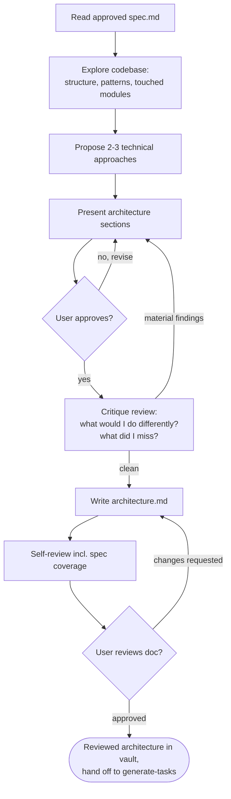

# Architect

Turn an approved spec into a technical architecture document. The spec settled the **what and why**; this skill settles the **how**: which components exist, how they integrate, which technologies are used, and how data flows through the system. The output is the source document for the generate-tasks skill.

**Announce at start:** "I'm using the architect skill to design the technical architecture from the spec."

**Input:** the approved `spec.md` in the project's Obsidian vault, usually under `specs/YYYY-MM-DD-<topic>/`. If you don't have the path, ask for it before doing anything else. Do not start from a vague verbal description — if there is no spec, use the brainstorming skill first.

**Output:** `architecture.md` next to the spec, linking back to it.

<HARD-GATE>
Do NOT invoke any implementation skill, write any code, or scaffold anything until the architecture document is written and the user has approved it. The terminal state of this skill is a reviewed architecture document in the vault.
</HARD-GATE>

## Scaling Down

Every project that goes through brainstorming also goes through this step, but the document scales to the work. For trivial changes — no new components, following an existing pattern — the architecture doc can be half a page: which files are touched, which existing pattern is followed, one small diagram if there is any flow at all. Produce it in the same sitting, present it, get approval, move on. The gate that matters is that generate-tasks has a technical document to consume, not that a ritual was performed.

## Checklist

You MUST create a task for each of these items and complete them in order:

1. **Read the spec** — fully, including constraints and open questions
2. **Explore the codebase** — existing structure, patterns, and the modules this work will touch
3. **Propose 2-3 technical approaches** — with trade-offs and your recommendation
4. **Present the architecture** — in sections scaled to their complexity, get user approval after each section
5. **Critique review** — attack the approved architecture: what would I do differently, what did I miss? (see below)
6. **Write architecture doc** — follow the Architecture Document Structure, save next to the spec as `architecture.md`
7. **Self-review** — spec coverage, consistency, diagram quality, real code references (see below)
8. **User reviews written doc** — ask user to review the architecture file before proceeding

## Process Flow

## The Process

**Reading the spec:**

- Read the whole spec, not just the chosen direction. Goals & Non-Goals bound the design; Constraints bind it hard; Open Questions may need resolving here.
- If the spec is ambiguous or contradicts what you find in the codebase, raise it with the user before designing around it. Do not silently reinterpret the spec — if the resolution changes a business decision, that belongs back in the spec.

**Exploring the codebase:**

- Explore the current structure before proposing anything. Use the codebase memory graph and ast-grep/ripgrep to find the modules, patterns, and conventions this work will touch.
- Follow existing patterns. A design that fights the codebase's conventions is wrong even if it is elegant in isolation.
- Where existing code has problems that affect the work (e.g., a file that's grown too large, unclear boundaries, tangled responsibilities), include targeted improvements as part of the design — the way a good developer improves code they're working in. Don't propose unrelated refactoring.

**Exploring technical approaches:**

- Propose 2-3 different technical approaches with trade-offs: different decompositions, different technologies, different integration styles
- This is where implementation-level choices are settled — which database, which library, how modules split, sync vs async, where state lives
- Respect the spec's Constraints section; a constraint is not up for redesign here
- Present options conversationally with your recommendation and reasoning; lead with your recommended option and explain why

**Presenting the architecture:**

- Scale each section to its complexity: a few sentences if straightforward, up to 200-300 words if nuanced
- Ask after each section whether it looks right so far
- Cover: components and boundaries, data flow, technology choices, integration points, error handling, testing
- Be ready to go back and clarify if something doesn't make sense

**Design for isolation and clarity:**

- Break the system into smaller units that each have one clear purpose, communicate through well-defined interfaces, and can be understood and tested independently
- For each unit, you should be able to answer: what does it do, how do you use it, and what does it depend on?
- Can someone understand what a unit does without reading its internals? Can you change the internals without breaking consumers? If not, the boundaries need work.
- Smaller, well-bounded units are also easier for you to work with - you reason better about code you can hold in context at once, and your edits are more reliable when files are focused. When a file grows large, that's often a signal that it's doing too much.

**Critique review (after approval, before writing the doc):**

Step back and attack the approved architecture as if reviewing a colleague's work. Ask yourself:

- What would I do differently if I started over? Was any approach dismissed too quickly?
- What did I miss? Edge cases, failure modes, migrations, concurrency, operational concerns, security implications?
- Where will this design bend or break if the spec's Open Questions resolve the other way?
- What would a skeptical senior engineer poke at first?

If the critique surfaces anything material, bring it back to the user before writing the doc ("before I write this up, the critique pass raised X") and revise if needed. If nothing material comes up, say so briefly and continue. Either way, keep the critique findings — they go into the document's Critique Findings section as part of the reasoning trail.

## Architecture Document Structure

Write for a reader who has read the spec but knows nothing about how the solution is shaped. Diagrams carry the structure; prose carries the why. Every diagram is paired with prose — the diagram shows the shape, the prose explains the reasoning. Scale each section to the project — a small change gets short sections, not fewer sections.

Required sections, in order:

1. **Summary** — two or three sentences: the technical shape of the solution. Link to the spec.
2. **Considered Approaches** — every technical approach discussed, including the discarded ones. For each: what it was, what made it attractive, and the specific reason it was rejected. This section prevents future readers from relitigating settled decisions.
3. **System Overview** — the chosen architecture at a glance: components and how they relate. Use a mermaid `flowchart`. Name real modules and files where they already exist.
4. **Components** — for each new or significantly modified unit: its purpose, its interface (how consumers use it), and what it depends on. Reference real paths and existing patterns to follow.
5. **Data & Flows** — how data moves and changes. Use mermaid: `sequenceDiagram` for interactions between components or services, `flowchart` for decision logic, `stateDiagram-v2` for lifecycles, `erDiagram` for data models and schema changes.
6. **Technology Choices** — libraries, services, storage, protocols: what was chosen and why, including what was deliberately not adopted.
7. **Error Handling & Edge Cases** — what can go wrong and what the system does about it.
8. **Testing Strategy** — how we will know it works: what gets unit tests, what needs integration coverage, what is verified manually.
9. **Critique Findings** — the output of the critique review: what was reconsidered, what was missed and then addressed, and anything accepted as a known limitation.
10. **Open Questions** — anything deferred to implementation, and what would resolve it.

## After the Design

**Documentation:**

- Write the validated architecture to the project vault on obsidian at `specs/YYYY-MM-DD-<topic>/architecture.md`, next to `spec.md`, with a link back to the spec
  - (User preferences for location override this default)

**Self-Review:**
After writing the document, look at it with fresh eyes:

1. **Spec coverage:** Every Goal in the spec maps to something in this design; nothing here serves a Non-Goal. Every Constraint is respected. This is the drift guard between the two documents — list gaps and fix them.
2. **Placeholder scan:** Any "TBD", "TODO", incomplete sections, or hand-waved mechanisms? Fix them.
3. **Internal consistency:** Do the diagrams match the prose? Does a component's interface match how other sections use it?
4. **Pointers are real:** Referenced files, modules, and patterns exist in the codebase (or are clearly marked as new). Never invent paths.
5. **Diagram check:** Every flow is shown as a mermaid diagram paired with prose; no diagram floats unexplained.
6. **Feasibility check:** Could the generate-tasks skill decompose this into commit-sized tasks without guessing? If a section is too vague to plan from, sharpen it.
7. **YAGNI check:** Anything designed that no spec goal asks for? Cut it.

Fix any issues inline. No need to re-review — just fix and move on.

For a larger or higher-stakes design, dispatch an independent subagent to review it instead of relying on your own read. Use the prompt template at `skills/architect/architecture-document-reviewer-prompt.md`.

**User Review Gate:**
After the self-review passes, ask the user to review the written document before proceeding:

> "Architecture written to vault `<path>`. Please review it and let me know if you want to make any changes"

Wait for the user's response. If they request changes, make them and re-run the self-review. Only proceed once the user approves.

**Hand-off:**
Once the user approves the architecture, suggest loading the **generate-tasks** skill — it breaks the architecture document into an ordered, commit-sized task list.

## Key Principles

- **The spec is the contract** - Design within its goals, non-goals, and constraints; push spec changes back to the spec, don't absorb them silently
- **Explore before designing** - Read the real codebase; follow its patterns
- **Diagrams plus prose** - Mermaid shows the shape, prose explains the why
- **Explore alternatives** - Always propose 2-3 technical approaches before settling
- **YAGNI ruthlessly** - Design only what the spec's goals require
- **Critique your own work** - After approval, ask what you would do differently and what you missed
- **Incremental validation** - Present sections, get approval before moving on
- **Preserve the reasoning trail** - Discarded approaches and the why behind decisions belong in the document
- **Scale to the work** - A trivial change gets a half-page document, not a ceremony
