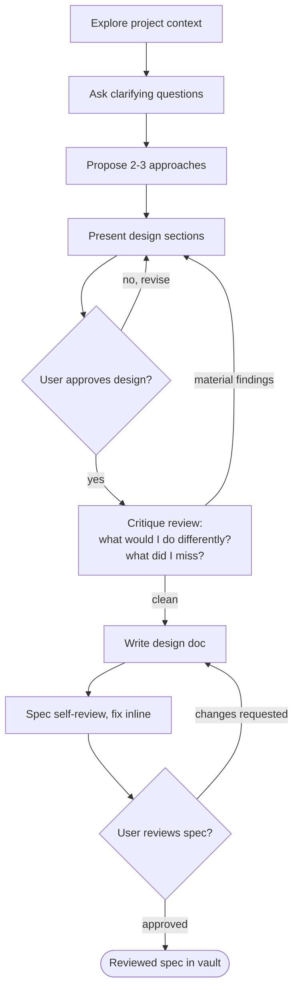

# Brainstorming Ideas Into Designs

Help turn ideas into fully formed designs and specs through natural collaborative dialogue.

Start by understanding the current project context, then ask questions one at a time to refine the idea. Once you understand what you're building, present the design and get user approval.

<HARD-GATE>
Do NOT invoke any implementation skill, write any code, scaffold any project, or take any implementation action until you have presented a design and the user has approved it. This applies to EVERY project regardless of perceived simplicity.
</HARD-GATE>

## Anti-Pattern: "This Is Too Simple To Need A Design"

Every project goes through this process. A todo list, a single-function utility, a config change — all of them. "Simple" projects are where unexamined assumptions cause the most wasted work. The design can be short (a few sentences for truly simple projects), but you MUST present it and get approval.

## Checklist

You MUST create a task for each of these items and complete them in order:

1. **Explore project context** — check files, docs, recent commits
2. **Ask clarifying questions** — one at a time, understand purpose/constraints/success criteria
3. **Propose 2-3 approaches** — with trade-offs and your recommendation
4. **Present design** — in sections scaled to their complexity, get user approval after each section
5. **Critique review** — step back and attack the approved design: what would I do differently, what did I miss? (see below)
6. **Write design doc** — follow the Design Document Structure, save to obsidian vault for the project the format is `specs/YYYY-MM-DD-<topic>/design.md`
7. **Spec self-review** — quick inline check for placeholders, contradictions, ambiguity, scope (see below)
8. **User reviews written spec** — ask user to review the spec file before proceeding

## Process Flow

**The terminal state is finished writing the reviewed plan to obsidian.** Do NOT invoke frontend-design, mcp-builder, or any other implementation skill.

## The Process

**Understanding the idea:**

- Check out the current project state first (files, docs, recent commits)
- Before asking detailed questions, assess scope: if the request describes multiple independent subsystems (e.g., "build a platform with chat, file storage, billing, and analytics"), flag this immediately. Don't spend questions refining details of a project that needs to be decomposed first.
- If the project is too large for a single spec, help the user decompose into sub-projects: what are the independent pieces, how do they relate, what order should they be built? Then brainstorm the first sub-project through the normal design flow. Each sub-project gets its own spec → plan → implementation cycle.
- For appropriately-scoped projects, ask questions one at a time to refine the idea
- Prefer multiple choice questions when possible, but open-ended is fine too
- Only one question per message - if a topic needs more exploration, break it into multiple questions
- Focus on understanding: purpose, constraints, success criteria
- Use the grill-me skill to help with questions

**Exploring approaches:**

- Propose 2-3 different approaches with trade-offs
- Present options conversationally with your recommendation and reasoning
- Lead with your recommended option and explain why

**Presenting the design:**

- Once you believe you understand what you're building, present the design
- Scale each section to its complexity: a few sentences if straightforward, up to 200-300 words if nuanced
- Ask after each section whether it looks right so far
- Cover: architecture, components, data flow, error handling, testing
- Be ready to go back and clarify if something doesn't make sense

**Critique review (after design approval, before writing the doc):**

Step back and attack the approved design as if reviewing a colleague's work. Ask yourself:

- What would I do differently if I started over? Was any approach dismissed too quickly?
- What did I miss? Edge cases, failure modes, migrations, operational concerns, security implications?
- Which assumptions did we never validate with the user?
- What would a skeptical senior engineer poke at first?

If the critique surfaces anything material, bring it back to the user before writing the doc ("before I write this up, the critique pass raised X") and revise the design if needed. If nothing material comes up, say so briefly and continue. Either way, keep the critique findings — they go into the design doc's Critique Findings section as part of the reasoning trail.

**Design for isolation and clarity:**

- Break the system into smaller units that each have one clear purpose, communicate through well-defined interfaces, and can be understood and tested independently
- For each unit, you should be able to answer: what does it do, how do you use it, and what does it depend on?
- Can someone understand what a unit does without reading its internals? Can you change the internals without breaking consumers? If not, the boundaries need work.
- Smaller, well-bounded units are also easier for you to work with - you reason better about code you can hold in context at once, and your edits are more reliable when files are focused. When a file grows large, that's often a signal that it's doing too much.

**Working in existing codebases:**

- Explore the current structure before proposing changes. Follow existing patterns.
- Where existing code has problems that affect the work (e.g., a file that's grown too large, unclear boundaries, tangled responsibilities), include targeted improvements as part of the design - the way a good developer improves code they're working in.
- Don't propose unrelated refactoring. Stay focused on what serves the current goal.

## Design Document Structure

Write the spec for a reader with zero context: a junior developer or a new stakeholder should be able to read it top to bottom and understand what is being built, why it matters, and why this shape and not another. Record the reasoning, not just the conclusions. Scale each section to the project — a small utility gets short sections, not fewer sections.

Required sections, in order:

1. **Summary** — two or three sentences: what we are building and why it matters.
2. **Context & Problem** — the situation that motivated this work, what hurts today, and what happens if we do nothing. Define domain terms a newcomer would not know.
3. **Goals & Non-Goals** — explicit lists of what this design delivers and what it deliberately leaves out.
4. **Considered Alternatives** — every approach discussed during brainstorming, including the discarded ones. For each: what it was, what made it attractive, and the specific reason it was rejected. This section prevents future readers from relitigating settled decisions.
5. **Chosen Design** — architecture, components, and how they interact. Use mermaid diagrams for anything with a flow: `flowchart` for decision logic and data flow, `sequenceDiagram` for interactions between components or services, `stateDiagram-v2` for lifecycles, `erDiagram` for data models. Every diagram is paired with prose — the diagram shows the shape, the prose explains the why.
6. **Error Handling & Edge Cases** — what can go wrong and what the system does about it.
7. **Testing Strategy** — how we will know it works.
8. **Critique Findings** — the output of the critique review: what was reconsidered, what was missed and then addressed, and anything accepted as a known limitation.
9. **Open Questions** — anything deferred, and what would resolve it.

## After the Design

**Documentation:**

- Write the validated design (spec) following the Design Document Structure above to the project vault on obsidian at `specs/YYYY-MM-DD-<topic>/design.md`
  - (User preferences for spec location override this default)

**Spec Self-Review:**
After writing the spec document, look at it with fresh eyes:

1. **Placeholder scan:** Any "TBD", "TODO", incomplete sections, or vague requirements? Fix them.
2. **Internal consistency:** Do any sections contradict each other? Does the architecture match the feature descriptions?
3. **Scope check:** Is this focused enough for a single implementation plan, or does it need decomposition?
4. **Ambiguity check:** Could any requirement be interpreted two different ways? If so, pick one and make it explicit.
5. **Structure check:** All sections from the Design Document Structure present? Discarded alternatives recorded with their rejection reasons? Flows shown as mermaid diagrams with accompanying prose?
6. **Audience check:** Could a junior developer or new stakeholder follow the reasoning without prior context? Any unexplained jargon or assumed knowledge? Fix it.

Fix any issues inline. No need to re-review — just fix and move on.

For a larger or higher-stakes spec, dispatch an independent subagent to review it instead of relying on your own read. Use the prompt template at `skills/brainstorming/spec-document-reviewer-prompt.md`.

**User Review Gate:**
After the spec review loop passes, ask the user to review the written spec before proceeding:

> "Spec written to vault `<path>`. Please review it and let me know if you want to make any changes"

Wait for the user's response. If they request changes, make them and re-run the spec review loop. Only proceed once the user approves.

## Key Principles

- **One question at a time** - Don't overwhelm with multiple questions
- **Multiple choice preferred** - Easier to answer than open-ended when possible
- **YAGNI ruthlessly** - Remove unnecessary features from all designs
- **Explore alternatives** - Always propose 2-3 approaches before settling
- **Critique your own work** - After approval, ask what you would do differently and what you missed
- **Incremental validation** - Present design, get approval before moving on
- **Preserve the reasoning trail** - Discarded ideas and the why behind decisions belong in the spec
- **Be flexible** - Go back and clarify when something doesn't make sense
