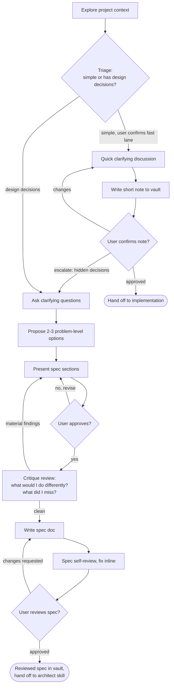

# Brainstorming Ideas Into Specs

Help turn ideas into a spec through natural collaborative dialogue. The spec captures the **what and why**: the problem, the goals, the options considered, and the business-level decisions. It deliberately stops short of the technical **how** — architecture, technology choices, and diagrams belong to the architect skill, which consumes the spec as its input.

Start by understanding the current project context, then **triage the request** onto one of two lanes: the **full spec flow** for anything with real design decisions, or the **fast lane** for genuinely simple, well-understood changes. Whichever lane, ask questions one at a time to refine the idea before acting.

<HARD-GATE>
Do NOT invoke any implementation skill, write any code, scaffold any project, or take any implementation action until EITHER:
- (full spec flow) you have presented a spec and the user has approved it, OR
- (fast lane) you have written the short note and the user has confirmed the lane and the note.

You may never skip straight to implementation with no triage, no discussion, and no user confirmation.
</HARD-GATE>

## Triage: Fast Lane vs Full Spec Flow

Before anything else, decide which lane the request belongs on. **You propose the lane and its reasoning; the user confirms or overrides.** State your read explicitly — e.g. *"This looks simple enough to skip the full spec — I'd do a quick pass and go straight to implementation. Sound right?"* — and wait for confirmation before proceeding on the fast lane.

**Fast lane** — genuinely simple, when ALL of these hold:

- Single, well-understood change with a clear intent
- Bounded blast radius: one file or one small module, no new subsystem
- No real design trade-offs — there isn't a menu of options worth weighing
- Low ambiguity: success is obvious and checkable
- A wrong move is cheap to reverse

Typical fast-lane work: a bug fix, a config tweak, a small helper, a copy/string change, an obvious local refactor, a well-specified one-liner.

**Full spec flow** — the default whenever ANY of these appear:

- New feature, component, or capability that didn't exist
- Genuine options with trade-offs to weigh
- Cross-cutting or multi-subsystem impact
- Ambiguous requirements or unstated business decisions
- A wrong decision is expensive to reverse

**When in doubt, choose the full spec flow.** The fast lane is a deliberate exception for the truly simple, not the default. If you start on the fast lane and discover hidden design decisions or ambiguity, stop and escalate to the full flow — tell the user why.

## Anti-Pattern: Fast-Laning To Dodge The Work

The fast lane exists for genuinely simple changes, not to avoid thinking. Do not classify something as simple just because the user seems in a hurry, because the spec feels tedious, or because the change "looks" like a one-liner before you've understood it. "Simple" projects with hidden design decisions are where unexamined assumptions cause the most wasted work. If the criteria above don't ALL hold, it's the full spec flow.

## Fast Lane Checklist

For requests triaged onto the fast lane, complete these in order — no spec, no architect, no generate-tasks:

1. **Explore project context** — check the relevant files, docs, recent commits
2. **Propose the lane** — state that this looks simple, why, and get the user's confirmation to skip the full spec
3. **Quick clarifying discussion** — a short back-and-forth (one question at a time) to nail down exactly what's being changed and how you'll know it's right
4. **Write the short note** — 3-5 lines: the problem and what you're going to do; save to the vault at `specs/YYYY-MM-DD-<topic>/note.md`
5. **User confirms the note** — a quick "here's what I'll do, look right?" before touching code
6. **Hand off to implementation** — proceed directly to implementing the change

If the discussion surfaces real design decisions or ambiguity, escalate to the full spec flow and tell the user why.

## Full Spec Flow Checklist

You MUST create a task for each of these items and complete them in order:

1. **Explore project context** — check files, docs, recent commits
2. **Ask clarifying questions** — one at a time, understand purpose/constraints/success criteria
3. **Propose 2-3 options** — problem-level alternatives with trade-offs and your recommendation
4. **Present the spec** — in sections scaled to their complexity, get user approval after each section
5. **Critique review** — step back and attack the approved direction: what would I do differently, what did I miss? (see below)
6. **Write spec doc** — follow the Spec Document Structure, save to obsidian vault for the project the format is `specs/YYYY-MM-DD-<topic>/spec.md`
7. **Spec self-review** — quick inline check for placeholders, contradictions, ambiguity, scope (see below)
8. **User reviews written spec** — ask user to review the spec file before proceeding

## Process Flow

**Two terminal states.** On the **fast lane**, the terminal state is a confirmed short note, and the next step is implementation directly. On the **full spec flow**, the terminal state is a reviewed spec in obsidian — do NOT invoke frontend-design, mcp-builder, or any other implementation skill; the next step is the **architect** skill, which turns the spec into a technical architecture document.

## The Process

**Triage first:**

- After exploring context, decide the lane (see the Triage section above) and propose it to the user with your reasoning. Proceed on the fast lane only once the user confirms. When in doubt, use the full spec flow.

**Understanding the idea:**

- Check out the current project state first (files, docs, recent commits)
- Before asking detailed questions, assess scope: if the request describes multiple independent subsystems (e.g., "build a platform with chat, file storage, billing, and analytics"), flag this immediately. Don't spend questions refining details of a project that needs to be decomposed first.
- If the project is too large for a single spec, help the user decompose into sub-projects: what are the independent pieces, how do they relate, what order should they be built? Then brainstorm the first sub-project through the normal flow. Each sub-project gets its own spec → architecture → tasks → implementation cycle.
- For appropriately-scoped projects, ask questions one at a time to refine the idea
- Prefer multiple choice questions when possible, but open-ended is fine too
- Only one question per message - if a topic needs more exploration, break it into multiple questions
- Focus on understanding: purpose, constraints, success criteria
- Use the grill-me skill to help with questions

**Exploring options:**

- Propose 2-3 different options at the problem level: scope variations, build vs buy vs adapt, phased vs all-at-once, which users/flows to serve first
- Keep the discussion at the level of what to build and why — implementation-level choices (which database, which library, how modules split) are settled later by the architect skill. If a technical constraint genuinely shapes the decision (e.g., "we must stay on the existing stack"), record it as a constraint, not a design.
- Present options conversationally with your recommendation and reasoning
- Lead with your recommended option and explain why

**Presenting the spec:**

- Once you believe you understand what you're building and why, present the spec
- Scale each section to its complexity: a few sentences if straightforward, up to 200-300 words if nuanced
- Ask after each section whether it looks right so far
- Cover: problem, goals and non-goals, options considered, success criteria, constraints
- Be ready to go back and clarify if something doesn't make sense

**Critique review (after approval, before writing the doc):**

Step back and attack the approved direction as if reviewing a colleague's work. Ask yourself:

- What would I do differently if I started over? Was any option dismissed too quickly?
- What did I miss? Unstated requirements, affected users, operational or security implications, business risks?
- Which assumptions did we never validate with the user?
- What would a skeptical stakeholder poke at first?

If the critique surfaces anything material, bring it back to the user before writing the doc ("before I write this up, the critique pass raised X") and revise if needed. If nothing material comes up, say so briefly and continue. Either way, keep the critique findings — they go into the spec's Critique Findings section as part of the reasoning trail.

## Fast Lane Note Structure

For fast-lane changes, skip the full spec structure and write a short note (3-5 lines) to `specs/YYYY-MM-DD-<topic>/note.md`:

- **What** — the change in one sentence
- **Why** — the problem or reason it's needed
- **Done when** — the observable condition that means it's finished

No options analysis, no critique pass, no architect hand-off. Confirm the note with the user, then implement.

## Spec Document Structure

Write the spec for a reader with zero context: a junior developer or a new stakeholder should be able to read it top to bottom and understand what is being built, why it matters, and why this shape and not another. Record the reasoning, not just the conclusions. Scale each section to the project — a small utility gets short sections, not fewer sections.

Required sections, in order:

1. **Summary** — two or three sentences: what we are building and why it matters.
2. **Context & Problem** — the situation that motivated this work, what hurts today, and what happens if we do nothing. Define domain terms a newcomer would not know.
3. **Goals & Non-Goals** — explicit lists of what this work delivers and what it deliberately leaves out.
4. **Considered Options** — every problem-level option discussed during brainstorming, including the discarded ones. For each: what it was, what made it attractive, and the specific reason it was rejected. This section prevents future readers from relitigating settled decisions.
5. **Chosen Direction** — the option we picked and the reasoning, described in terms of outcomes and behavior, not implementation. What will exist that doesn't today, and how a user or caller experiences it.
6. **Success Criteria** — how we will know the work achieved its purpose. Observable, checkable conditions.
7. **Constraints** — hard boundaries the technical design must respect: existing stack, compliance, deadlines, budget, compatibility.
8. **Critique Findings** — the output of the critique review: what was reconsidered, what was missed and then addressed, and anything accepted as a known limitation.
9. **Open Questions** — anything deferred, and what would resolve it.

Architecture, component design, data flows, error handling, and testing strategy do NOT belong here — they are the architect skill's output. If the conversation surfaced strong technical opinions, record them under Constraints (if binding) or Open Questions (if advisory) so the architect inherits them.

## After the Spec

**Documentation:**

- Write the validated spec following the Spec Document Structure above to the project vault on obsidian at `specs/YYYY-MM-DD-<topic>/spec.md`
  - (User preferences for spec location override this default)

**Spec Self-Review:**
After writing the spec document, look at it with fresh eyes:

1. **Placeholder scan:** Any "TBD", "TODO", incomplete sections, or vague requirements? Fix them.
2. **Internal consistency:** Do any sections contradict each other? Do the goals match the chosen direction?
3. **Scope check:** Is this focused enough for a single architecture document, or does it need decomposition?
4. **Ambiguity check:** Could any requirement be interpreted two different ways? If so, pick one and make it explicit.
5. **Altitude check:** Did implementation detail leak in — technology picks, module layouts, diagrams? Move binding items to Constraints and drop the rest; the architect decides the how.
6. **Structure check:** All sections from the Spec Document Structure present? Discarded options recorded with their rejection reasons?
7. **Audience check:** Could a junior developer or new stakeholder follow the reasoning without prior context? Any unexplained jargon or assumed knowledge? Fix it.

Fix any issues inline. No need to re-review — just fix and move on.

For a larger or higher-stakes spec, dispatch an independent subagent to review it instead of relying on your own read. Use the prompt template at `skills/brainstorming/spec-document-reviewer-prompt.md`.

**User Review Gate:**
After the spec review loop passes, ask the user to review the written spec before proceeding:

> "Spec written to vault `<path>`. Please review it and let me know if you want to make any changes"

Wait for the user's response. If they request changes, make them and re-run the spec review loop. Only proceed once the user approves.

**Hand-off:**
Once the user approves the spec, suggest loading the **architect** skill — it reads the spec, explores the codebase, and produces the technical architecture document (`architecture.md`) that generate-tasks consumes.

## Key Principles

- **One question at a time** - Don't overwhelm with multiple questions
- **Multiple choice preferred** - Easier to answer than open-ended when possible
- **YAGNI ruthlessly** - Remove unnecessary features from all options
- **Stay at problem altitude** - The spec records what and why; the architect decides how
- **Explore options** - Always propose 2-3 options before settling
- **Critique your own work** - After approval, ask what you would do differently and what you missed
- **Incremental validation** - Present sections, get approval before moving on
- **Preserve the reasoning trail** - Discarded options and the why behind decisions belong in the spec
- **Be flexible** - Go back and clarify when something doesn't make sense
