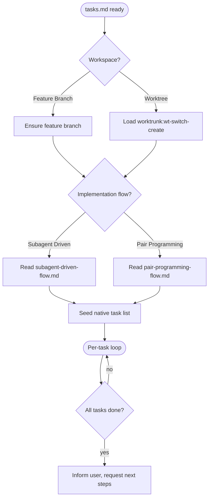

# Implementing Tasks

## Overview

Take a `tasks.md` task list — produced by the [[generate-tasks]] skill — and work it to completion, one commit-sized task at a time. Each task runs through the same loop: **implement → code review → mark done in Obsidian**, then on to the next.

**Announce at start:** "I'm using the implementing-tasks skill to implement the task list."

**Input:** the `tasks.md` (and its sibling `design.md`) in the project's Obsidian vault, usually under `specs/YYYY-MM-DD-<feature>/`. If you don't have the path, ask for it before doing anything else.

## When to Use

- You have a finished `tasks.md` and are about to start writing code.
- You want each task tracked as its own commit and marked done as you go.

**When NOT to use:**
- No task list yet → use the [[generate-tasks]] skill first.
- A single ad-hoc change with no task list → just do it.

## The Two Decisions

Before any code, make two choices **with the user** via `AskUserQuestion`. Don't assume — ask.

### Decision 1 — Workspace

Ask: **Feature Branch** or **Worktree**?

- **Feature Branch:** If you're already on a feature branch (anything other than the default `main`/`master`/`develop`), keep it. Otherwise create one named `feat/<feature>`, `bug/<feature>`, or `chore/<feature>` matching the work.
- **Worktree:** Load the `worktrunk:wt-switch-create` skill and create a new worktree for this feature, then continue inside it.

### Decision 2 — Implementation Flow

Ask: **Subagent Driven** or **Single-Agent Pair Programming**?

- **Subagent Driven** → read and follow `subagent-driven-flow.md` in this skill directory.
- **Single-Agent Pair Programming** → read and follow `pair-programming-flow.md` in this skill directory.

Both flows run the same per-task loop; they differ only in *who* writes the code.

## Seed the Native Task List

Before the loop, mirror `tasks.md` into your preferred task-tracking tool — the harness's native task list (`TaskCreate`). This gives the user live, in-session progress alongside the Obsidian checkboxes.

- Parse the `## Progress` section of `tasks.md` and create **one tracked task per entry**, in the same order, with the same titles.
- Keep both views in sync throughout the loop: the native list is the working tracker; the Obsidian checkboxes are the durable record.
- If the tool is unavailable, skip silently and rely on the Obsidian checkboxes alone — do not block on it.

## The Per-Task Loop (both flows)

For each unchecked task in `tasks.md`, in dependency order:

1. **Mark it in progress** in the native task list (`TaskUpdate` → `in_progress`).
2. **Read the task** plus the relevant parts of `design.md`. Honour `Depends on`.
3. **Implement** the task (who does this depends on the chosen flow).
4. **Code review** the change (delegated to a review agent in both flows).
5. **Address review findings**, then **commit** using the task's suggested message.
6. **Mark the task done** — set it `completed` in the native task list **and** check its box in the `## Progress` section plus its acceptance criteria in `tasks.md` in Obsidian.

A task is not done until it is reviewed, committed, and checked off in both the native list and Obsidian.

## Handling Confusion

If an implementing or reviewing agent is blocked or unsure, it must **ping the parent (this session) and wait** — never guess. The parent analyses the question against `design.md`/`tasks.md`; if it still can't be resolved, the parent asks the user via `AskUserQuestion` and relays the answer back.

## Once All Tasks Are Done

Confirm every box in `## Progress` is checked, every native task is `completed`, and tests pass. Then **inform the user** the task list is complete and **ask for next steps** (e.g. open a PR, merge, finish the branch). Do not auto-merge or push unless asked.

## Common Mistakes

- Skipping the two decisions and silently picking a flow. Always ask.
- Forgetting to seed the native task list before the loop starts.
- Marking a task done before review and commit. Order is fixed.
- Letting an agent invent answers when confused instead of pinging up.
- Forgetting to update `tasks.md` in Obsidian (and the native list) after each task.
