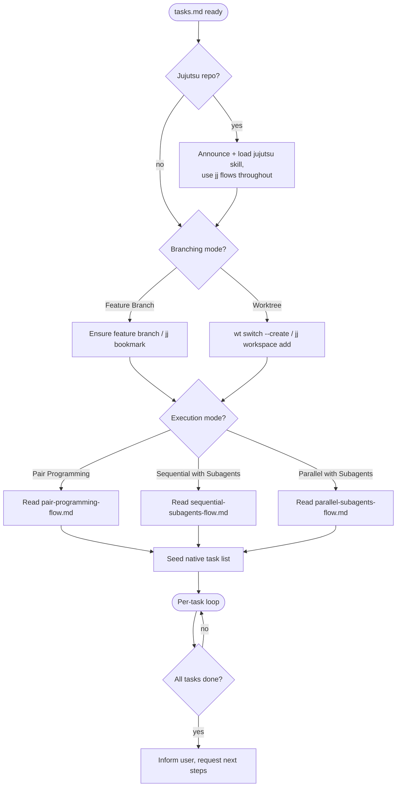

# Implementing Tasks

## Overview

Take a `tasks.md` task list — produced by the [[generate-tasks]] skill — and work it to completion, one commit-sized task at a time. Each task runs through the same loop: **implement → code review → mark done in Obsidian**, then on to the next.

**Announce at start:** "I'm using the implementing-tasks skill to implement the task list."

**Input:** the `tasks.md` (and its siblings `architecture.md` and `spec.md`) in the project's Obsidian vault, usually under `specs/YYYY-MM-DD-<feature>/`. If you don't have the path, ask for it before doing anything else.

## When to Use

- You have a finished `tasks.md` and are about to start writing code.
- You want each task tracked as its own commit and marked done as you go.

**When NOT to use:**
- No task list yet → use the [[generate-tasks]] skill first.
- A single ad-hoc change with no task list → just do it.

## Detect the Version Control System

Before the two decisions, detect whether the repo is managed by **Jujutsu**. Check for a `.jj/` directory at the repo root (e.g. `jj root` succeeds).

- **Jujutsu detected** → **announce it**: "This repo uses Jujutsu — I'll use the jj flows for branching and commits." Then **load the [[jujutsu]] skill** and use jj commands throughout the rest of this skill: bookmarks instead of git branches, `jj workspace` instead of `git worktree`, `jj commit`/`jj describe` instead of `git commit`. If the repo is colocated (`.jj/` **and** `.git/`), still prefer jj for all writes.
- **No `.jj/`** → use the standard git flows exactly as written below.

The two decisions and the per-task loop have the **same shape** either way; only the underlying VCS commands change. Use this mapping wherever a step below names a git command:

| Step | git flow | jj flow (see [[jujutsu]]) |
|------|----------|---------------------------|
| Feature line | `git switch -c feat/<x>` | work on a stack, then `jj bookmark create feat/<x> -r @` |
| Isolated workspace | `wt switch --create feat/<x>` | `jj workspace add ../<feature>` |
| Commit a task | `git add -A && git commit -m "..."` | `jj commit -m "..."` (no staging) |
| Merge a parallel wave into base | merge the wave branch | `jj rebase -s <wave-root> -d <base-bookmark>`, then advance the base bookmark |
| Open a PR at the end | `git push` + `gh pr create` | follow the "open a PR" flow in the jujutsu skill's `references/git-interop.md` |

## The Two Decisions

Before any code, make two choices **with the user** via `AskUserQuestion`. Don't assume — ask. The decisions are orthogonal: **Branching Mode** is *where* the work lands, **Execution Mode** is *how* tasks get implemented.

### Decision 1 — Branching Mode

Ask: **Feature Branch** or **Worktree**?

- **Feature Branch:** If you're already on a feature branch (anything other than the default `main`/`master`/`develop`), keep it. Otherwise create one named `feat/<feature>`, `bug/<feature>`, or `chore/<feature>` matching the work.
- **Worktree:** Create one with worktrunk — `wt switch --create feat/<feature>` — then continue inside it. Worktrunk places the worktree per project config and runs the project's post-create hooks (env setup, deps), so prefer it over raw `git worktree` commands.

Either way the result is one **base workspace** — the branch or worktree where every task ultimately lands. The execution flows call it the *base*.

**On a Jujutsu repo:** "Feature Branch" means building your stack of task commits and putting a **bookmark** on the tip (`jj bookmark create <name> -r @`) — bookmarks don't auto-advance, so re-`set` it as the stack grows. "Worktree" means a **jj workspace** (`jj workspace add`), each with its own `@`. See the [[jujutsu]] skill for the mechanics.

### Decision 2 — Execution Mode

Ask: **Pair Programming**, **Sequential with Subagents**, or **Parallel with Subagents**?

- **Pair Programming** → read and follow `pair-programming-flow.md`. You write the code yourself with the user; only review is delegated. Always one task at a time.
- **Sequential with Subagents** → read and follow `sequential-subagents-flow.md`. Subagents implement in the base workspace, strictly one task at a time in list order — even when `tasks.md` marks tasks as parallelizable.
- **Parallel with Subagents** → read and follow `parallel-subagents-flow.md`. Uses the `## Execution Waves` section of `tasks.md`: tasks in the same wave run concurrently, each in its own throwaway worktree, and are merged back into the base at the end of the wave.

All modes run the same per-task loop; they differ in *who* writes the code and *how many* tasks are in flight at once.

If the user picks Parallel but `tasks.md` has no `## Execution Waves` section (older list), derive the waves yourself — same wave only when tasks have no dependency path between them **and** disjoint code pointers — and confirm the grouping with the user before starting.

## Seed the Native Task List

Before the loop, mirror `tasks.md` into your preferred task-tracking tool — the harness's native task list (`TaskCreate`). This gives the user live, in-session progress alongside the Obsidian checkboxes.

- Parse the `## Progress` section of `tasks.md` and create **one tracked task per entry**, in the same order, with the same titles.
- Keep both views in sync throughout the loop: the native list is the working tracker; the Obsidian checkboxes are the durable record.
- If the tool is unavailable, skip silently and rely on the Obsidian checkboxes alone — do not block on it.

## The Per-Task Loop (all modes)

For each unchecked task in `tasks.md`, in dependency order:

1. **Mark it in progress** in the native task list (`TaskUpdate` → `in_progress`).
2. **Read the task** plus the relevant parts of `architecture.md`. Honour `Depends on`.
3. **Implement** the task (who does this depends on the chosen mode).
4. **Code review** the change (delegated to a review agent in all modes).
5. **Address review findings**, then **commit** using the task's suggested message (`git commit` on a git repo; `jj commit -m` on a Jujutsu repo — no staging).
6. **Mark the task done** — set it `completed` in the native task list **and** check its box in the `## Progress` section plus its acceptance criteria in `tasks.md` in Obsidian.

A task is not done until it is reviewed, committed, and checked off in both the native list and Obsidian.

In Parallel mode, steps 1–5 run concurrently for every task in the current wave, each in its own worktree; step 6 happens only after that task's branch is merged back into the base and the base is green. The mechanics live in `parallel-subagents-flow.md`.

## Handling Confusion

If an implementing or reviewing agent is blocked or unsure, it must **ping the parent (this session) and wait** — never guess. The parent analyses the question against `architecture.md`/`spec.md`/`tasks.md`; if it still can't be resolved, the parent asks the user via `AskUserQuestion` and relays the answer back.

## Once All Tasks Are Done

Confirm every box in `## Progress` is checked, every native task is `completed`, and tests pass. Then **inform the user** the task list is complete and **ask for next steps** (e.g. open a PR, merge, finish the branch). Do not auto-merge or push unless asked. On a Jujutsu repo, set the bookmark on the tip and follow the "open a PR" flow in the [[jujutsu]] skill's `references/git-interop.md` when the user asks to push.

## Common Mistakes

- Skipping the two decisions and silently picking a mode. Always ask.
- Not checking for `.jj/` first, then using git commands on a Jujutsu repo. Detect the VCS before branching or committing.
- On a jj repo, committing tasks but forgetting to move the bookmark to the tip before pushing — the pushed branch stays stale.
- Forgetting to seed the native task list before the loop starts.
- Marking a task done before review and commit. Order is fixed.
- Letting an agent invent answers when confused instead of pinging up.
- Forgetting to update `tasks.md` in Obsidian (and the native list) after each task.
- Parallelizing by vibes. Only the waves in `tasks.md` (or a user-confirmed derivation) define what may run concurrently.
- Starting the next wave before every task of the current wave is merged into the base and the suite is green there.
