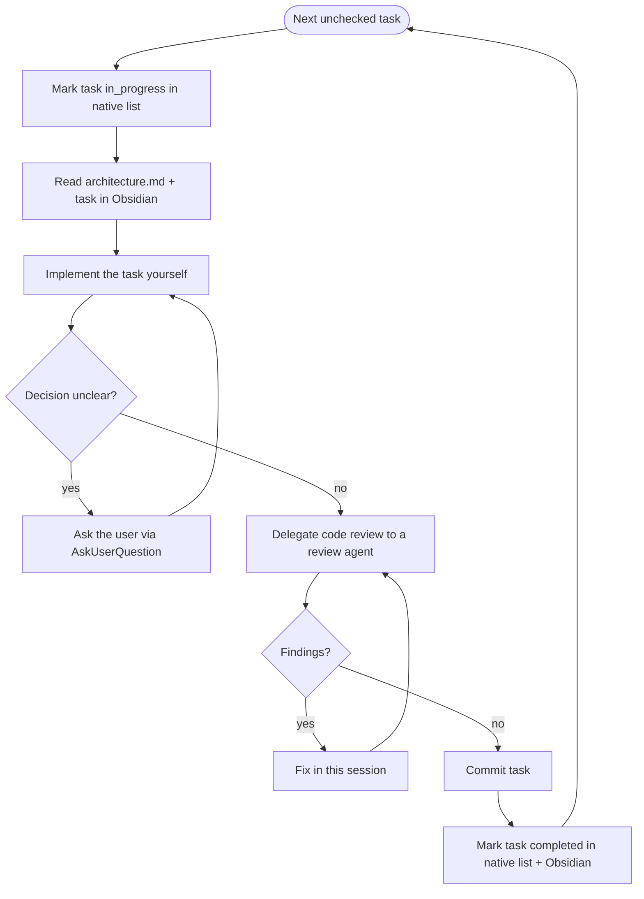

# Single-Agent Pair-Programming Flow

You (this session) are the **implementer**. You write the task code yourself, working with the user as a pair. You delegate only the **code review** to a separate agent.

Work happens directly in the base workspace, one task at a time in list order — the `## Execution Waves` section of `tasks.md` is ignored here; it only matters to the parallel flow.

## Flow

## How you work each task

1. **Mark it `in_progress`** in the native task list, then **read** `architecture.md` and the task in `tasks.md` (Obsidian). Honour `Depends on` and code pointers.
2. **Implement it yourself.** **Load and follow the `tdd` skill** (mandatory) — drive each task red-green-refactor: failing test first, make it pass, then refactor. Apply the **ponytail** skill — laziest, simplest solution that actually works. Pair with the user: surface decisions, don't silently choose. When a design question can't be answered from the docs, ask via `AskUserQuestion`.
3. **Delegate code review** to a review agent. That agent:
   - Reads `architecture.md` and the task.
   - Uses the **ponytail-review** skill plus the task's acceptance criteria.
   - Reports findings back to you; if it's unsure, it pings you and waits.
4. **Address findings**, re-review if needed, then **commit** with the task's suggested message (`git commit` on git; `jj commit -m` on Jujutsu — no staging).
5. **Mark the task done** — set it `completed` in the native task list and check its box and acceptance criteria in `tasks.md` in Obsidian.

When all tasks are checked off, return to the SKILL.md "Once All Tasks Are Done" step: inform the user and request next steps.
