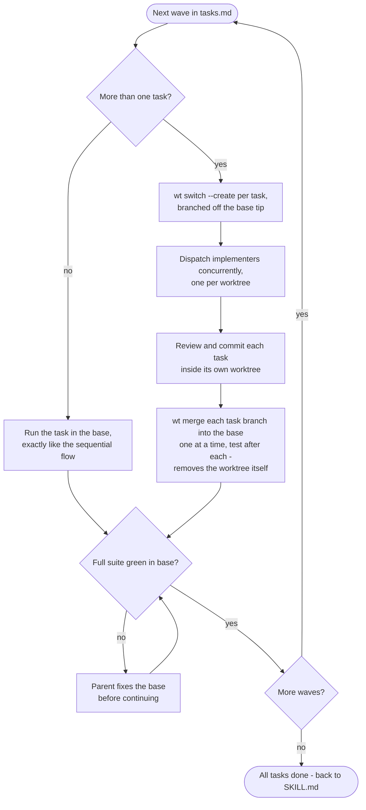

# Parallel Subagent Flow

You (this session) are the **parent/orchestrator**. You do not write task code yourself. Tasks run wave by wave, following the `## Execution Waves` section of `tasks.md`: every task in a wave is implemented concurrently in its own throwaway git worktree, then merged back into the base workspace (the feature branch or worktree from Branching Mode) before the next wave starts.

All worktree operations go through **worktrunk** (`wt`) — it places worktrees per project config, runs the project's post-create hooks (env setup, deps), and its `wt merge` collapses the rebase/fast-forward/remove dance into one command. Do not fall back to raw `git worktree` unless `wt` is unavailable.

## Requirements

- `tasks.md` must have a `## Execution Waves` section. If it doesn't (older list), derive the waves yourself — two tasks share a wave only when there is no dependency path between them **and** their `Create:`/`Modify:` pointers touch disjoint files — and confirm the grouping with the user via `AskUserQuestion` before starting.
- Waves are a hard barrier: wave N+1 must not start until every wave-N task is merged into the base and the full test suite passes there.

## Flow



## Per-wave procedure

**Single-task wave:** skip the worktree machinery — run the task directly in the base workspace, exactly as the sequential flow does (implementer subagent, review agent, commit, mark done).

**Multi-task wave:**

1. Mark every task of the wave `in_progress` in the native task list.
2. For each task, create a throwaway worktree branched from the current tip of the base (`--no-cd` keeps your shell in the base; `-y` skips prompts):

   ```
   wt switch --create task/<n>-<slug> --base <base-branch> --no-cd -y
   ```

   Get each worktree's path from `wt list --format json`.
3. Dispatch one implementer subagent per task, all concurrently, each pointed at its own worktree path. Pick or create agents the same way the sequential flow does: prefer a specialised agent over a generic one, choose the model by task complexity. Every implementer follows the same rules: read `design.md` and its task first, **tdd skill mandatory**, **ponytail** for simplicity, implement only the assigned task, and **ping the parent and wait** when blocked — never guess.
4. Each task is code-reviewed inside its own worktree (separate review agent, **ponytail-review** plus the task's acceptance criteria) and committed there as **a single commit** with the task's suggested message — review fixes get amended in, not stacked as extra commits.

**Reintegration (parent does this, one task at a time):**

1. Merge each task branch into the base with worktrunk, pointing `-C` at the task worktree. `--no-squash` preserves the task's commit message (the branch already holds exactly one commit); the command rebases onto the base, fast-forwards it, and removes the worktree in one go:

   ```
   wt -C <task-worktree-path> merge --no-squash <base-branch>
   ```

   Always pass the base branch explicitly — `wt merge` defaults to the repo's default branch, which is not where wave commits land.
2. After each merge, run the tests in the base. If the rebase stops on a conflict, resolve it in the task worktree and re-run the merge; test failures after a clean merge are fixed in the base. Either way it is the parent's job — do not re-dispatch the implementer for integration problems.
3. Only after its merge is in and the base is green: mark the task `completed` in the native list and check its box plus acceptance criteria in `tasks.md` in Obsidian.

**Wave gate:** with all wave tasks merged, run the whole test suite in the base once more. Green → next wave. Red → fix the base before proceeding; never start a wave on a broken base.

## Handling confusion

Same rule as the sequential flow: a blocked agent pings the parent and waits; the parent answers from `design.md`/`tasks.md` or escalates to the user via `AskUserQuestion` and relays the answer. With several agents in flight, answer pings promptly — a blocked agent stalls only its own worktree, but the wave cannot close until every task lands.

## Cleanup

Before declaring a wave (or the run) done: `wt list` shows no leftover task worktrees, `git branch` shows no leftover `task/` branches, and every commit is reachable from the base. `wt merge` removes the worktree and merged branch itself; if a task was abandoned mid-wave, clean it up with `wt remove -f -D task/<n>-<slug>` so nothing dangles.
