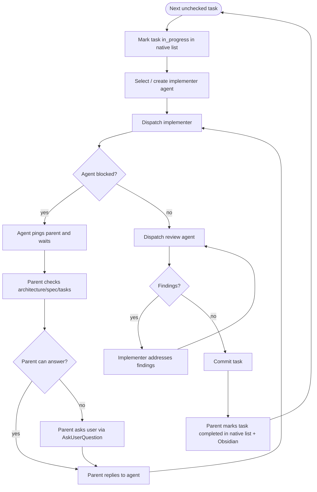

# Sequential Subagent Flow

You (this session) are the **parent/orchestrator**. You do not write task code yourself — you dispatch subagents and keep both the native task list and `tasks.md` in Obsidian up to date.

Tasks are implemented **strictly one at a time, in list order**, directly in the base workspace (the feature branch or worktree from Branching Mode). The `## Execution Waves` section of `tasks.md` is ignored here — it only matters to the parallel flow.

## Picking the implementer agent

For each task, before dispatching:

1. **Search for an existing agent** that fits the task (the Agent tool lists available agent types; prefer a specialised one — e.g. an Elixir, frontend, or domain agent — over a generic one).
2. **If none fits, create an ad-hoc agent.** Choose the model by task complexity:
   - Simple / mechanical (renames, wiring, small edits) → a fast model (e.g. Haiku/Sonnet).
   - Substantial logic, tricky design, or wide blast radius → the strongest model (Opus).
   - Name the agent after what it does: (e.g: implementer-clanker, review-clanker, etc.)
3. Use a **separate review agent** for the code-review step.

## Flow

## Agent instructions

**Every implementer agent must:**
- Read `architecture.md` and `tasks.md` in the Obsidian vault before coding.
- **Load and follow the `tdd` skill** (mandatory) — drive the task red-green-refactor: write a failing test first, make it pass, then refactor.
- Use the **ponytail** skill — laziest, simplest solution that actually works.
- Implement only the assigned task, respecting its `Depends on` and code pointers.
- If confused or needing a decision, **ping the parent and wait** — never guess.

**Every code-review agent must:**
- Read `architecture.md` and the task in `tasks.md`.
- Use the **ponytail-review** skill — review focused on over-engineering and simplification, plus the task's acceptance criteria.
- Report findings to the parent; if unsure, ping the parent and wait.

## Parent responsibilities per task

- Mark the task `in_progress` in the native task list before dispatching.
- Dispatch the implementer, then the reviewer.
- Resolve pings: answer from `architecture.md`/`tasks.md`, or escalate to the user via `AskUserQuestion`, then relay the answer.
- Once review passes, commit the task with its suggested message (`git commit` on git; `jj commit -m` on Jujutsu — no staging).
- After the commit lands, mark the task `completed` in the native list and **check its box and acceptance criteria** in `tasks.md` in Obsidian.
- Move to the next task. When all are done, hand back to the SKILL.md "Once All Tasks Are Done" step.
